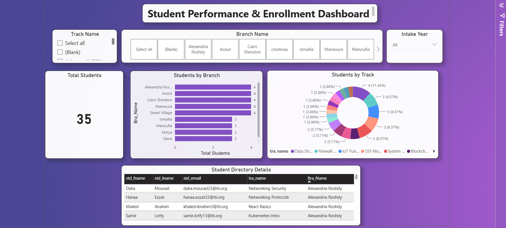
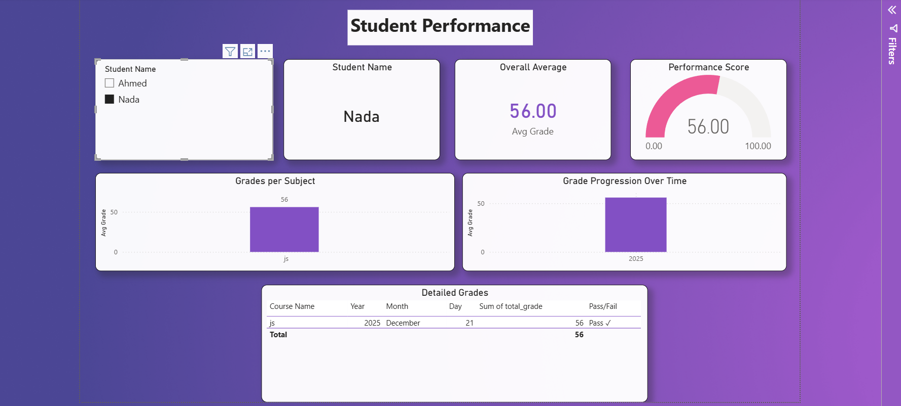
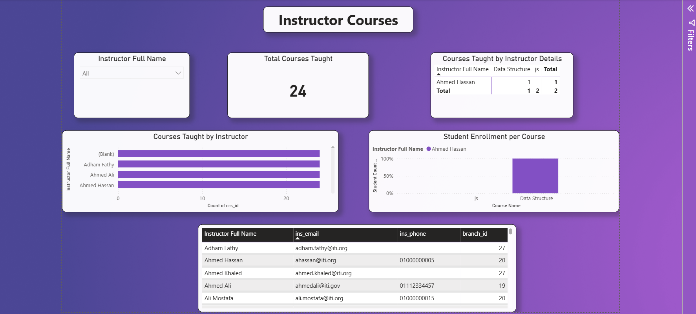
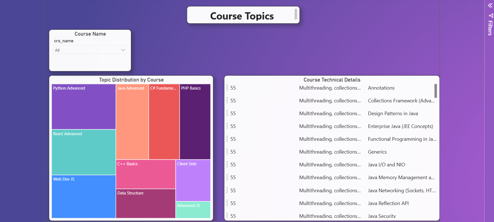
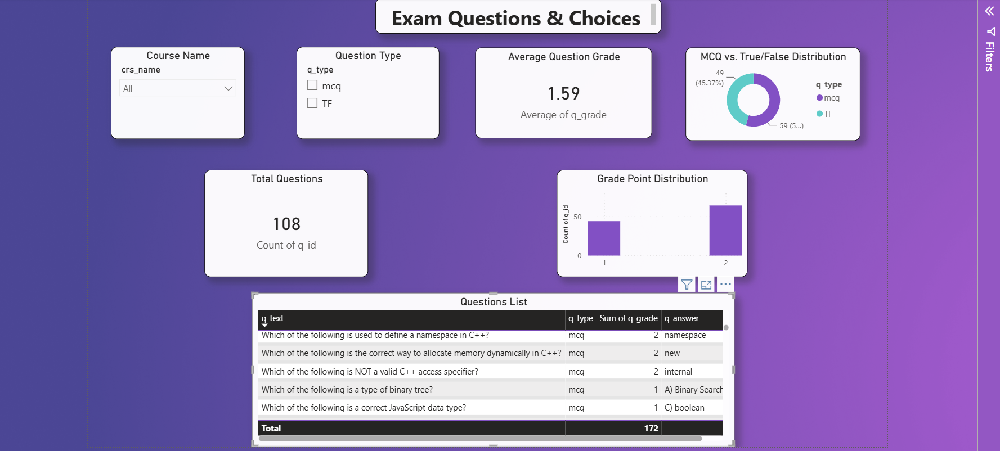
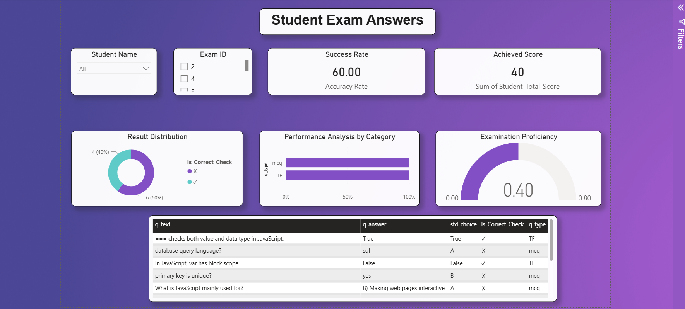

# 🎓 ITI Exam Management System (Fullstack)


A comprehensive Fullstack Web Application designed for the **Information Technology Institute (ITI)** to manage the entire examination process. This system facilitates seamless interactions between the administration (Staff) and students, featuring automated exam generation, secure student assessment, and dynamic performance reporting.

---

## 🎥 Project Demo
> **Note:** Watch the video below to see a full walkthrough of the system, including the Admin dashboard, exam generation, and the student's exam experience.

<video src="./ProjectVideo.mp4" controls="controls" muted="muted" autoplay="autoplay" loop="loop" width="100%"></video>

---

## 📸 Screenshots

### 📊 Power BI Analytics & Reports




### 💻 Web Application (Admin & Student)








---

## 💡 Project Idea
The core idea is to digitalize the ITI examination process. 
- **For Admins (Staff):** They can generate exams dynamically by selecting a course and specifying the number of MCQ and True/False questions. The system picks questions randomly from a pre-populated database. Admins can also add students, review their answers, and view statistics.
- **For Students:** They can log into a secure portal using their credentials, enter their assigned `Exam ID`, and take the exam in a user-friendly interface. Grades are calculated automatically and instantly synced with the database.

---

## 🚀 Key Features

### 🛡️ Admin / Staff Features
- **Secure Authentication:** JWT-based login with Role-Based Access Control (RBAC).
- **Automated Exam Generation:** Create unique exams by specifying the course ID and the distribution of question types.
- **Student Management:** Add new students to the system securely.
- **Performance Analytics:** View detailed statistics for each exam and review specific student answers and grades.
- **Power BI Integration:** Advanced data visualization and reporting through connected Power BI dashboards.

### 👨‍🎓 Student Features
- **Dedicated Student Portal:** A focused environment for taking assessments.
- **Seamless Exam Execution:** Enter the `Exam ID` to instantly fetch the exam paper and begin.
- **Real-time Submission:** Securely submit answers to the backend for immediate grading.

---

## 🛠️ Tech Stack & Tools Used

### Backend (API)
- **Framework:** ASP.NET Core Web API (.NET 9 / 10)
- **Architecture:** Clean Architecture + CQRS Pattern (using MediatR)
- **Security:** ASP.NET Core Identity + JWT Bearer Authentication
- **Database Access:** Entity Framework Core (EF Core) + Stored Procedures
- **Logging:** Serilog
- **Documentation:** Swagger / OpenAPI

### Frontend (Client)
- **Library:** React 19
- **Build Tool:** Vite 7
- **Routing:** React Router v7
- **HTTP Client:** Axios (with interceptors for JWT injection)
- **Icons:** Lucide React
- **Styling:** Custom CSS for a modern, responsive UI

### Database & Analytics
- **Database Engine:** Microsoft SQL Server (Hosted on MonsterASP)
- **Data Analytics:** Power BI (Data visualizations and statistical reports)

---

## 📂 Folder Hierarchy

```text
ITI-Exam-Management-System/
│
├── Backend/                 # ASP.NET Core Web API Project
│   ├── Controllers/         # API Endpoints
│   ├── Core/                # CQRS (Commands & Queries using MediatR)
│   ├── Entity/              # Domain Models & Stored Procedures Mapping
│   ├── Infrastructure/      # Repositories & Data Access
│   ├── Services/            # Business Logic & JWT Provider
│   └── Program.cs           # API Entry Point & Configurations
│
├── Frontend/                # React + Vite Project
│   ├── src/
│   │   ├── api/             # Axios instance & Interceptors
│   │   ├── components/      # React Components (Login, Dashboards, Exam Viewer)
│   │   ├── security/        # Protected Routes Logic
│   │   └── style/           # CSS files for UI components
│   └── package.json         # Frontend dependencies
│
├── Database_And_Reports/    # Database Backups & Analytics
│   ├── dbReports.pbix       # Power BI Dashboard file
│   └── db34662_custom.bak   # SQL Server Database Backup file
│
├── Screenshots/             # Project screenshots
├── ProjectVideo.mov         # Demo Video
└── README.md                # This documentation file
```

---

## ⚙️ How to Run Locally

### 1. Backend Setup
1. Open a terminal and navigate to the `Backend` directory:
   ```bash
   cd Backend
   ```
2. Restore NuGet packages:
   ```bash
   dotnet restore
   ```
3. Run the API (The server will start at `http://localhost:5183`):
   ```bash
   dotnet run
   ```

### 2. Frontend Setup
1. Open a **new terminal** and navigate to the `Frontend` directory:
   ```bash
   cd Frontend
   ```
2. Install Node modules:
   ```bash
   npm install
   ```
3. Start the Vite development server (runs at `http://localhost:5173`):
   ```bash
   npm run dev
   ```

*(Ensure both servers are running simultaneously for the app to function properly).*

---

## 👥 Project Team
This project was developed by:
- **Ahmed Ashraf Mohammed**
- **Abdelrahman Fathy Ahmed**
- **Abdelrahman Mohamed Abdelaty**
- **Ahmed Abdelaal Abdellatif**
- **Sama Bahgat Abdallah Farag**
